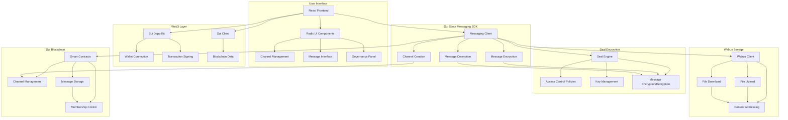

# 🐝 Hive - Decentralized Web3 Messaging

> **Built on Sui Stack Messaging SDK** - The future of private, decentralized communication

Hive is a cutting-edge Web3 messaging application that leverages the complete Sui Stack Messaging SDK to deliver enterprise-grade decentralized communication. Experience end-to-end encryption with Seal, decentralized storage via Walrus, and lightning-fast transactions on Sui blockchain.

## 🚀 Features

### Core Messaging
- **1:1 & Group Messaging**: Create direct channels or multi-member groups with defined access rules
- **End-to-End Encryption**: Powered by Seal with programmable access control policies
- **Decentralized Storage**: Walrus for content-addressed, verifiable file sharing
- **On-Chain Metadata**: Encrypted message objects and metadata stored on Sui

### Advanced Channel Types
- **Standard Channels**: Private messaging between users
- **Token-Gated Channels**: Access controlled by NFT ownership or token balance
- **DAO Assembly Channels**: Governance-focused channels with voting and proposals
- **Subscription Channels**: Premium content with SUI-based subscriptions

### Web3 Integration
- **Wallet Connection**: Seamless integration with Sui wallets
- **SuiNS Support**: Human-readable addresses (alice.sui)
- **Cross-Platform**: Available on web, mobile, and desktop
- **Recoverable**: Sync conversations across devices

## 🏗️ Tech Stack

### Sui Stack Messaging SDK
- **Sui Blockchain**: Smart contracts for channels, messages, and membership
- **Seal Encryption**: End-to-end encryption with programmable access control
- **Walrus Storage**: Decentralized, content-addressed storage for attachments

### Frontend
- **React 18**: Modern React with hooks and functional components
- **TypeScript**: Type-safe development
- **Radix UI**: Accessible component library
- **Tailwind CSS**: Utility-first styling
- **Vite**: Fast build tool and dev server

### Web3 Integration
- **Sui Dapp Kit**: Wallet connection and transaction signing
- **Sui Client**: Blockchain interaction and data fetching
- **SuiNS Service**: Name resolution and address lookup

## 📊 Architecture Flow



## 🔐 Security & Privacy

### Seal Encryption
- **End-to-End Encryption**: Messages encrypted before leaving the client
- **Programmable Access**: Define who can access content and when
- **Key Recovery**: Secure key management with device synchronization
- **Zero-Knowledge**: We cannot see your messages, even if we wanted to

### Walrus Storage
- **Content-Addressed**: Files identified by their content hash
- **Verifiable**: Cryptographic proofs of file integrity
- **Permissionless**: No central authority controls access
- **Decentralized**: Distributed storage network

### Sui Blockchain
- **On-Chain Metadata**: Message references and channel info on-chain
- **Smart Contracts**: Programmable messaging logic
- **Instant Finality**: Fast transaction confirmation
- **Auditable**: Transparent and verifiable communication records

## 🚀 Getting Started

### Prerequisites
- Node.js 18+ and pnpm
- Sui wallet (Sui Wallet, Suiet, etc.)
- Sui testnet tokens for transactions

### Installation

1. **Clone the repository**
   ```bash
   git clone https://github.com/your-username/hive.git
   cd hive
   ```

2. **Install dependencies**
   ```bash
   pnpm install
   ```

3. **Start development server**
   ```bash
   pnpm dev
   ```

4. **Open your browser**
   Navigate to `http://localhost:5173`

### First Steps

1. **Connect Wallet**: Click "Connect Wallet" and select your Sui wallet
2. **Create Channel**: Use the "Create Channel" form to start messaging
3. **Explore Features**: Try different channel types and features
4. **Invite Friends**: Share channel invites with wallet addresses or SuiNS names

## 📱 Channel Types

### Standard Channels
- Private messaging between users
- Simple invitation system
- File sharing and voice messages

### Token-Gated Channels
- Access controlled by NFT ownership
- Token balance requirements
- Automatic membership verification

### DAO Assembly Channels
- Governance proposals and voting
- Member management
- Discussion threads
- Real-time voting results

### Subscription Channels
- Premium content access
- SUI-based subscriptions
- Monthly/yearly billing
- Creator monetization

## 🔧 Development

### Project Structure
```
hive/
├── src/
│   ├── components/          # React components
│   ├── hooks/              # Custom React hooks
│   ├── services/           # Business logic services
│   ├── types/              # TypeScript type definitions
│   ├── utils/              # Utility functions
│   └── providers/          # React context providers
├── sui-stack-messaging-sdk/ # SDK integration
└── public/                 # Static assets
```

### Key Services
- **MessagingService**: Core messaging functionality
- **TokenGatingService**: Access control logic
- **GovernanceService**: DAO governance features
- **WalrusService**: File storage operations
- **SuiNSService**: Name resolution

### Environment Setup
```bash
# Copy environment template
cp .env.example .env

# Configure Sui network
VITE_SUI_NETWORK=testnet
VITE_SUI_RPC_URL=https://fullnode.testnet.sui.io:443
```

## 🤝 Contributing

We welcome contributions! Please see our [Contributing Guidelines](CONTRIBUTING.md) for details.

### Development Workflow
1. Fork the repository
2. Create a feature branch
3. Make your changes
4. Add tests if applicable
5. Submit a pull request

## 📄 License

This project is licensed under the MIT License - see the [LICENSE](LICENSE) file for details.

## 🙏 Acknowledgments

- **Sui Foundation** for the amazing blockchain platform
- **Mysten Labs** for the Sui Stack Messaging SDK
- **Seal Team** for the encryption technology
- **Walrus Team** for the decentralized storage solution
- **BSA Community** for the hackathon opportunity

## 📞 Support

- **Discord**: [Sui Discord](https://discord.com/channels/916379725201563759/1417696942074630194)
- **GitHub Issues**: [Report bugs or request features](https://github.com/your-username/hive/issues)
- **Documentation**: [Sui Stack Messaging SDK Docs](https://github.com/MystenLabs/sui-stack-messaging-sdk)

---

**Built with ❤️ for the Sui x BSA Hackathon**

*Experience the future of Web3 messaging with Hive - where privacy meets innovation.*
