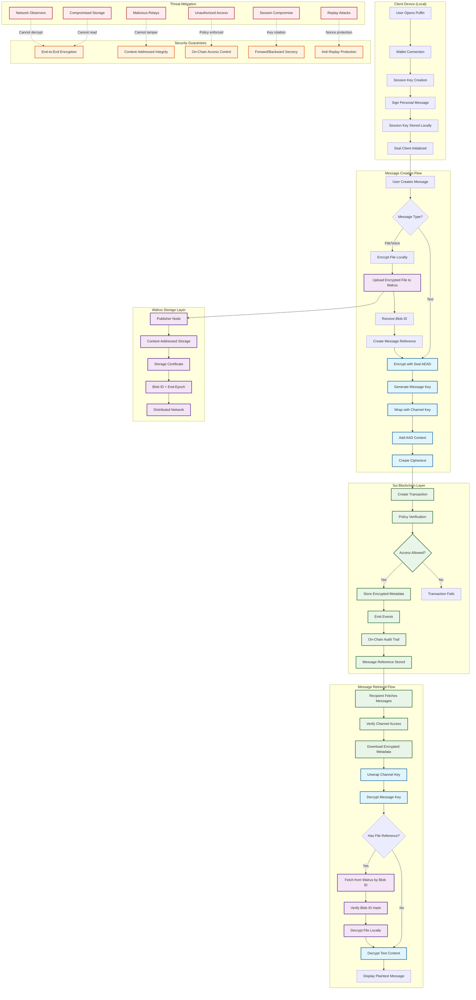

# Security & Privacy — Deep Technical Overview

This section details the security architecture behind Puffin's Decentralized, Privacy-first messaging: how Seal (encryption), Walrus (decentralized storage), and Sui (on-chain integrity) work together to provide end-to-end guarantees. No marketing fluff—just the model, the primitives, and the protocols.

## 1) Security Architecture at a Glance

**Client-side, end-to-end encryption (E2EE) with Seal.** All plaintext handling occurs locally; servers and storage only ever see ciphertext.

**Decentralized storage via Walrus.** Ciphertext is content-addressed; integrity is provable, availability is networked—not platform-controlled.

**On-chain integrity and access signals on Sui.** Encrypted metadata, access policies, and message references are verifiable and auditable without exposing content.

**Separation of powers:**

- **Seal** enforces Privacy (who can read).
- **Walrus** enforces Decentralized integrity and persistence (what is stored, provably).
- **Sui** enforces Programmable correctness (who is allowed, under which rules, with auditability).

## Security Architecture Flow

## 2) Threat Model

### Adversaries considered

- Passive network observers (global or local).
- Compromised storage nodes or infrastructure providers.
- Malicious relays/servers with full metadata visibility.
- Social adversaries attempting replay, tamper, or unauthorized reads.
- Rollback attempts against clients or storage.

### Out of scope

- Compromised user endpoints (malware, keyloggers).
- Physical device capture without hardware protections.
- Side-channel attacks on user devices.

**Design principle:** even if the transport layer, servers, or storage are compromised, Privacy holds (no plaintext leakage), Decentralized verifiability holds (tamper is detectable), and access remains governed by on-chain policy the adversary cannot forge.

## 3) Cryptographic Stack (Seal)

### 3.1 Message Encryption (AEAD)

- **Cipher:** Authenticated Encryption with Associated Data (AEAD), e.g., AES-256-GCM or ChaCha20-Poly1305.
- **Payload:** Serialized message content (text, file manifests, voice metadata) is encrypted with a fresh, per-message symmetric key.
- **AAD:** Channel ID, sender ID, message type, and protocol version bound as AAD to prevent cross-context replay and enable tamper-evident metadata.

### 3.2 Key Hierarchy

- **Root identity:** Wallet keypair (Sui account) establishes identity and signs capability delegations.
- **Session key:** Ephemeral, short-lived key material authorized by a wallet signature; scoped to a TTL and device context.
- **Channel key:** Symmetric key shared among authorized channel members; rotated on membership changes.
- **Message key:** Fresh symmetric key per message; wrapped (encrypted) under the current channel key.

This hierarchy confines blast radius: session compromise does not reveal past channel history; channel compromise does not reveal other channels; per-message keys localize exposure.

### 3.3 Session Key Protocol

- **Creation:** Client generates session key; user signs a personal message with their wallet to approve the delegation (capability grant).
- **TTL:** Strict time-to-live (e.g., 30 minutes) with auto-renewal on activity and hard expiration.
- **Binding:** Session tokens include device fingerprinting signals and policy claims (scope, channel set, capabilities).
- **Revocation:** Expiry enforces natural revocation; explicit on-chain policy updates or client invalidation can revoke earlier sessions.

### 3.4 Channel Access Control

- **Policy encoding:** Allowed members, token-gated conditions, subscription entitlements are expressed as policy artifacts whose hashes are pinned on-chain.
- **Envelope encryption:** Channel keys are individually wrapped for each member (asymmetric) or under policy-derived secrets; unauthorized users cannot unwrap.
- **Rotation events:** On member add/remove or policy change, a new channel key is generated and redistributed, sealing future messages from former members.

### 3.5 Integrity & Anti-Replay

- **Nonces:** Unique nonces per encryption; replay of ciphertext fails AEAD integrity.
- **AAD binding:** Context binding prevents replay across channels or different policy states.
- **On-chain references:** Message references and policy hashes on Sui create tamper-evident audit trails.

## 4) Decentralized Storage Security (Walrus)

### 4.1 Content-Addressed Ciphertext

- **Client-side encryption first:** Files, voice blobs, and attachments are encrypted with Seal before upload.
- **Blob ID:** Deterministic content hash over ciphertext yields a Blob ID; storage nodes cannot infer plaintext or correlate pre-encryption content.
- **Integrity:** Retrieval re-hash equals Blob ID; any bit-flip or tampering is detected client-side.

### 4.2 Storage Certificates & Epochs

- **Publisher → Aggregator flow:** Upload to a Publisher; receive a Storage Certificate containing the Blob ID and end-epoch (retention bound).
- **End-epoch semantics:** Defines minimum expected availability window. Clients can re-publish or extend epochs without revealing plaintext.
- **Auditability:** Certificates are verifiable artifacts; clients can prove a given ciphertext was advertised for storage through time.

### 4.3 Access and Metadata Privacy

- **No server trust:** Walrus nodes only see ciphertext and size; access control is enforced by Seal keys, not storage ACLs.
- **Metadata minimization:** Filenames, MIME types, and previews are processed locally; only encrypted manifests reach storage.
- **Linkability limits:** Identical ciphertexts yield identical Blob IDs (dedup). For stronger unlinkability, clients can add randomized padding or re-key before upload.

### 4.4 Availability & Recovery

- **Decentralized retrieval:** Aggregators fetch by Blob ID from the network. Multiple replicas and independent operators reduce single-point risks.
- **Client-side verification:** On download, clients validate Blob ID and decrypt with channel/session keys; failed decryption signals either mis-routing or tamper.

## 5) On-Chain Security (Sui)

### 5.1 Move and Object-Centric Safety

- **Resource safety:** The Move language enforces linear resource semantics; assets and capabilities cannot be duplicated or implicitly dropped.
- **Capability-based access:** Contracts encode who may mutate what; governance and channel membership are derived from explicit capabilities, not global mutability.
- **Determinism & audits:** State transitions are deterministic and fully auditable; no secret material is placed on-chain.

### 5.2 Integrity Anchors

- **Encrypted metadata on-chain:** References to messages (Blob IDs), policy hashes, and membership changes are recorded immutably.
- **Membership proofs:** Token gating and subscription checks are verifiable through contract calls; message send attempts fail if policy predicates are not met.
- **Event logs:** Emitted events create a verifiable history for governance and payments without exposing plaintext content.

### 5.3 Finality & Replay Boundaries

- **Fast finality:** BFT consensus (e.g., Narwhal/Bullshark stack) provides near-instant finality; clients can rely on observed state for policy decisions.
- **Sequence guards:** Contracts incorporate nonces and expected sequence numbers for messages where ordering matters (e.g., governance actions).

## 6) Transport & Application Security

- **Transport:** All RPCs and CDN hops use TLS 1.3; certificate pinning can be enabled in clients targeting high-assurance environments.
- **Signature discipline:** All capability grants and policy updates are signed with the user's wallet key; clients verify signatures before accepting state.
- **Hardening:** Strict Content Security Policy, dependency pinning, SRI for static assets, and build-time hashing to reduce supply-chain risk.

## 7) Group Messaging Security

- **Key distribution:** Channel key wrapped per member; adding a member triggers re-wrap for future messages without exposing past ciphertexts (backward secrecy).
- **Member removal:** On removal, rotate channel key; removed members cannot decrypt future messages (forward secrecy regarding future traffic).
- **Large groups:** For scale, tree-based or epoch-based rekeying strategies minimize bandwidth while preserving cryptographic guarantees.

## 8) Governance & Payments Security

- **Governance:** Proposals and ballots are encrypted with Seal; on-chain receipts anchor authenticity. Tally proofs can be revealed publicly without exposing individual ballots.
- **Payments:** Payment payloads (amount, memo, channel linking data) are encrypted in the message layer; on-chain transfers are verified via Sui receipts.
- **Atomicity:** Where required, message posting and payment references can be bundled under a single user intent to prevent partial completion.

## 9) Data Lifecycle, Recovery, and Deletion Semantics

- **Local-first keys:** Keys live on user devices; optional secure backup via user-controlled secret sharing or hardware enclaves.
- **Session expiry:** Session keys auto-expire; clients must refresh via wallet approval, constraining long-lived exposure.
- **Practical deletion:** Encrypted blobs can be logically tombstoned on-chain; effective unreadability comes from key destruction (crypto-erasure).

## 10) Privacy Guarantees and Limits

### Guaranteed by design

- Providers and storage nodes cannot read content (E2EE).
- Tamper is detectable (AEAD + Blob ID integrity).
- Unauthorized access fails cryptographically, not merely by policy.

### Not guaranteed

- Network-level metadata (timing, size) can leak behavior patterns; mitigations include padding, batching, and randomized delays.
- Endpoint compromise defeats E2EE; users should employ OS sandboxing, strong device auth, and consider hardware-backed key storage.

## 11) Implementation Notes and Safe Defaults

- **AEAD:** Prefer AES-256-GCM on AES-NI capable devices; fall back to ChaCha20-Poly1305 on mobile.
- **Randomness:** Use CSPRNG from the platform (Web Crypto / OS) for nonces and keys; never reuse nonces.
- **KDFs:** When deriving keys from passphrases or device secrets, use memory-hard KDFs (Argon2id) with tuned parameters; otherwise, derive session keys from wallet signatures and random salts.
- **Versioning:** All ciphertexts carry a protocol version; decryption enforces version gates to avoid downgrade attacks.
- **Key rotation:** Periodic rotation for channel keys; immediate rotation on membership changes.
- **Audit hooks:** Optional local audit logs (encrypted) for enterprises to meet compliance without centralizing plaintext.

## 12) Security Review Roadmap

- Static analysis of contracts and client crypto code paths.
- Property tests for envelope wrapping, rotation, and access policy transitions.
- Fuzzing of parsing and manifest handling.
- Red team drills on relay nodes and aggregator configurations.
- Independent cryptography review focusing on nonce discipline, AAD coverage, and key lifecycle.
